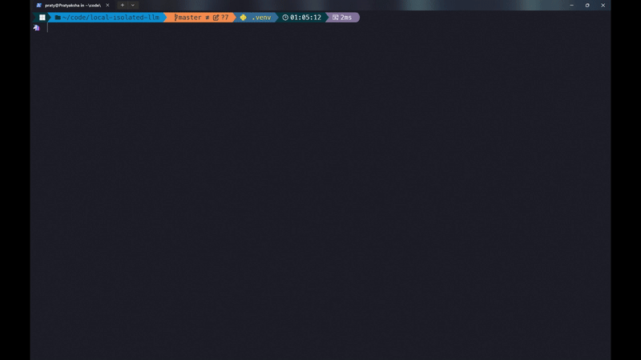

# Local And Isolated LLM
This project lets you run Large Language Models (LLMs) on your own machine using Hugging Face Transformers. No need for cloud services – just load up the model locally and get started. It's perfect for quick experiments, prototyping, or building cool AI apps without losing control or privacy.

Features:
- Run models locally for super fast responses.
- Full control over how the model runs and what it does.
- Simple CLI to chat with the model.

# Setup
- Create a python virtual environment: `python -m venv .venv`
- Activate the virtual environment: `.venv\Scripts\activate`
- Download the dependencies: `python -m pip install -r requirements.txt`
- Run the script: `python run_llm.py`

# Demo

# Note
- If you have GPU, ensure that CUDA toolkit is installed.